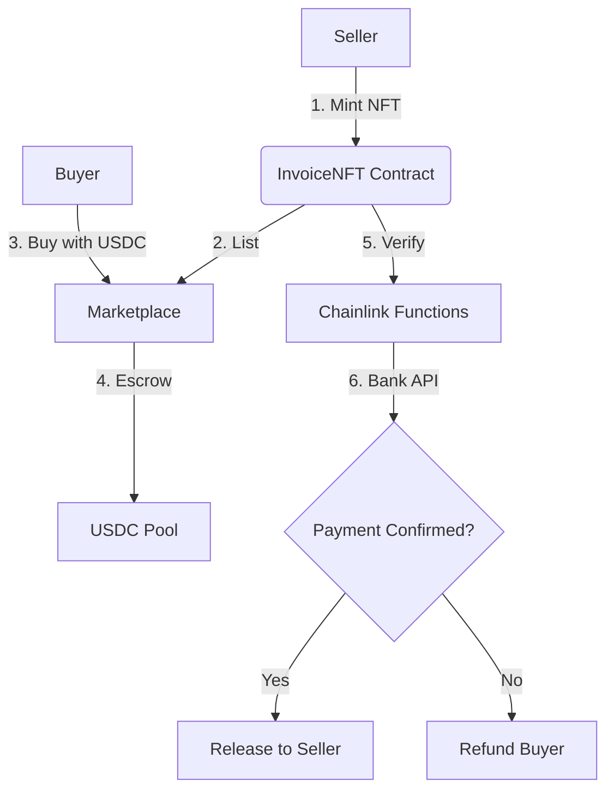

# Invoice Financing Protocol with Chainlink

[](https://chain.link/)
[](https://hardhat.org/)

A decentralized invoice financing platform where businesses can tokenize unpaid invoices as NFTs, with payment verification powered by Chainlink.

## Key Features

| Feature | Description |
|---------|-------------|
| **Invoice NFTs** | Tokenize real-world invoices as tradable ERC-721 assets |
| **Chainlink Functions** | Verify off-chain payments via bank/processor APIs |
| **Automated Settlements** | Chainlink Automation enforces due dates and penalties |
| **Price Oracle** | Accurate USDC/USD conversions via Chainlink Data Feeds |
| **Dispute Resolution** | VRF-selected auditors for contested invoices |

## Protocol Workflow



# Installation
```bash
git clone https://github.com/your-repo/invoice-financing.git
cd invoice-financing
npm install
```

# Configuration
```bash
SEPOLIA_RPC_URL="https://sepolia.infura.io/v3/YOUR_KEY"
PRIVATE_KEY="0xYOUR_KEY"
CHAINLINK_SUBSCRIPTION_ID=123
```

# Testing
```bash
npx hardhat test
```

# Architecture
contracts/
├── InvoiceNFT.sol           # Main logic (NFT minting/verification)
├── PriceOracle.sol          # USDC/USD conversions
├── Escrow.sol               # Payment escrow
└── interfaces/
    ├── IUSDC.sol            # USDC token interface
    └── IVRF.sol             # VRF consumer
